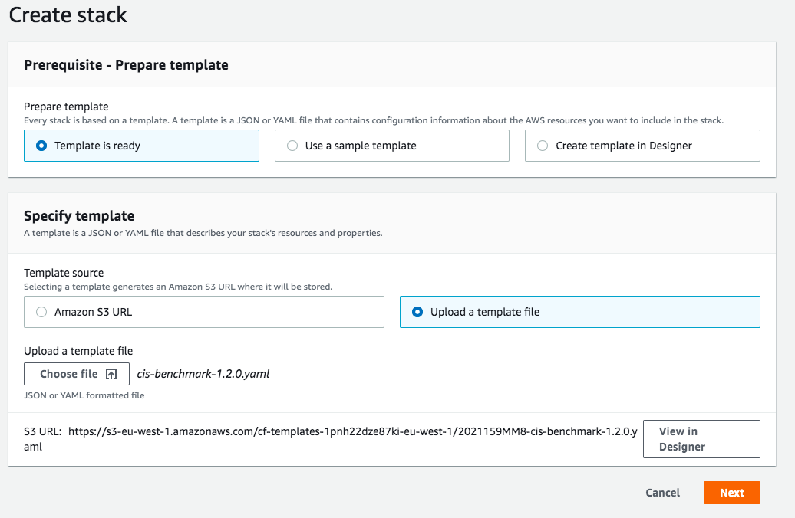
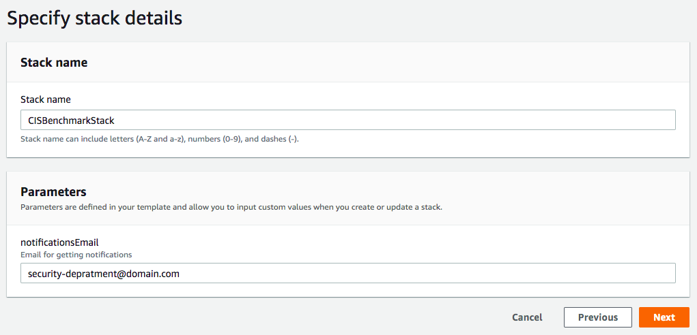
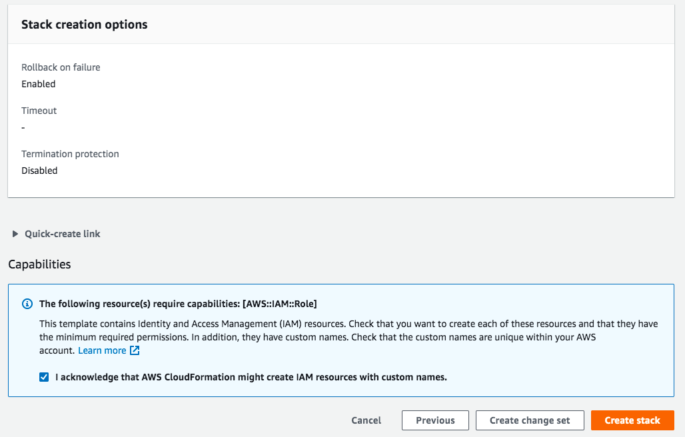

# aws-cis-benchmark-service

## Usage

This repository deploys all the resources needed controls of [CIS Amazon Web Services Foundations v1.2.0](https://d0.awsstatic.com/whitepapers/compliance/AWS_CIS_Foundations_Benchmark.pdf).

### Deployment

- In order to deploy the controls on your AWS account, pick the latest release from GitHub releases. When deploying the CloudFormation template, it should ask you for these parameters:
  - Stack Name - Should be `CISBenchmarkStack`.
  - Notifications Email - This would be the email that will receive all the alert notifications from the CIS Benchmark controls. That should be the account owner email / security architect to analyze the email and be aware of any unexpected activities on the account. Notice this has nothing to do with GuardDuty emails, which should be monitored seperately.
- Look on your email inbox. You should get a subscription request from AWS, please click on the link to confirm the subscription to start getting notifications from the CIS Benchmark Controls.
    
> Replace only the `Stack Name` and `notificationsEmail` parameters as needed.





### Upgrade

- In order to upgrade the controls on your AWS account, pick the latest release from GitHub releases. The, instead of creating a new stack on the CloudFormation interface, choose the previous stack (If you followed our naming convension, it would be named `JenkinsCISBenchmarkStackMaster`) and select the `Update` --> `Replace current template` --> `Upload a template file`. From the dialog box, select the new template you downloaded and replace only the `notificationsEmail` parameter if needed.

> Leave all parameters untouched. On upgrading process you won't need to change any parameters, unless specifically asked to do so.

## Contributing

### Pre-requisites

- NodeJS 12 or later AWS CDK command line interface installed on your computer.
  You can easily install AWS CDK command line interface it using `npm`:

  ```
  $ npm install -g aws-cdk
  ```

- Python 3.6 and up with Pipenv dependencies & virtual environment management framework.
  You can easily install Pipenv command line interface it using `pip`:
  
  ```
  $ pip install --upgrade pipenv
  ```

### Preparing the CDK Environment

To initiate the virtualenv on MacOS and Linux and install the required dependencies:

```
$ pipenv install --dev
```

After the init process completes, and the virtualenv is created, you can use the following
step to activate your virtualenv.

```
$ pipenv shell
```

At this point you can now synthesize the CloudFormation template for this code.

```
$ cdk synth
```

To add additional dependencies, for example other CDK libraries, just add
them to your `setup.py` file and run `pipenv --lock && pipenv sync`
command.

### Deployment

You can now deploy the CloudFormation template:

```
$ cdk deploy
```

Don't forget to approve the template and security resources before the deployment.

## License

See [LICENSE.md](LICENSE.md) file.